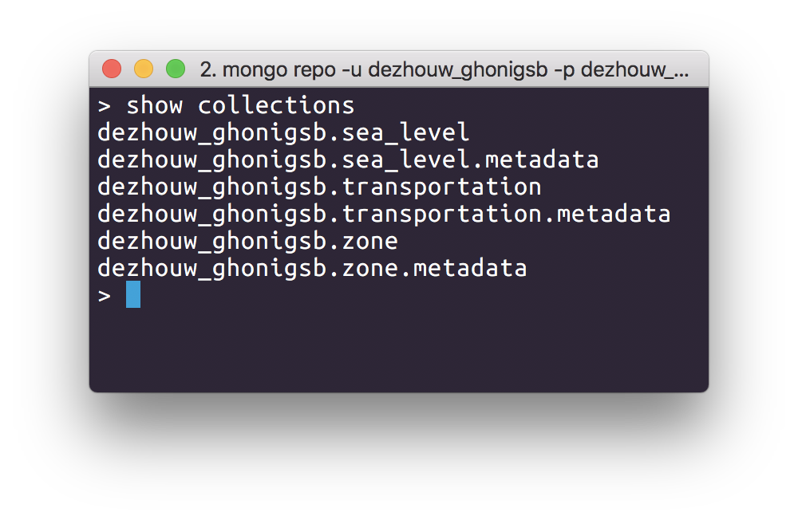
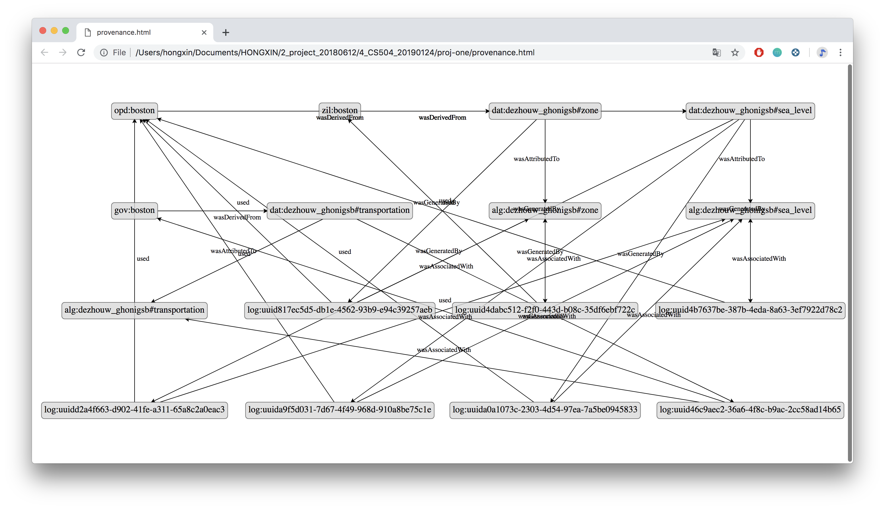

# CS 504 Project 1
### Group Members
|Name              |Nickname |GitHub Name|BU netName |BU email       |
|------------------|---------|-----------|-----------|---------------|
|Dezhou Wang       |Michael  |HONG-XIN   |dezhouw    |dezhouw@bu.edu |
|Gabriel Honigsberg|Gabe     |ghonigsberg|ghonigsb   |ghonigsb@bu.edu|

---

### Project Goal
How  will future flooding affect Boston?

The city of Boston has made data available showing where flooding will take place at both high tide and during the worst storm surges in future years. We would like to use this information, and apply it to other publicly available sets to discover how the city, its citizens, and industries will be most affected. Specifically, we will combine the flood data with other geographic data, such as zoning, traffic and home value data to show what types of areas areas will be affected and how great the impact might be. This information will inform how important action in preperation and prevention will be by demonstrating the scope of the issue. Hopefully the data will provide insight into who will be most affected and how. 

---

### Resources
* API: sea level rise (1) [Link](http://bostonopendata-boston.opendata.arcgis.com/datasets/9inch-sea-level-rise-1pct-annual-flood?geometry=-71.151%2C42.334%2C-70.931%2C42.379&selectedAttribute=Shape__Area)
* API: sea level rise (2) [link](http://bostonopendata-boston.opendata.arcgis.com/datasets/9inch-sea-level-rise-high-tide)
* API: sea level rise (3) [link](http://bostonopendata-boston.opendata.arcgis.com/datasets/74692fe1b9b24f3c9419cd61b87e4e3b_3)
* API: sea level rise (4) [link](http://bostonopendata-boston.opendata.arcgis.com/datasets/74692fe1b9b24f3c9419cd61b87e4e3b_5)
* Neighborhood Data [link](http://bostonopendata-boston.opendata.arcgis.com/datasets/3525b0ee6e6b427f9aab5d0a1d0a1a28_0)
* API: Zillow [link](https://www.zillow.com/webservice/GetRegionChildren.htm?zws-id=[ZWS-ID]&state=ma&city=boston&childtype=neighborhood). Zillow ID can be obtained by creating an account on the Zillow website [website](https://www.zillow.com/howto/api/APIOverview.htm)
* Mass DOT Transportation Data Management System: CSV was created from [Mass DOT Website](http://mass.gov/traffic-volume-and-classification), by using their Interactive Map application. In the application, we used the TCDS quick search tool by setting Community to Boston. After entering the search, data was generated using "Report Center" button. In this module, under "Reports" tab, we clicked on the Volume option, selecting "Peak Volume By Year". Then, under "Options", selected for Last 3 Years. After picking paramaters, generated data was downloaded as a CSV, and uploaded to [datamechanics.io](http://datamechanics.io) in folder ghonigsb_dezhouw.

---

### Idiosyncratic Details
Specific things in auth.json
Zillow API is obtained by logging into Zillow account.
Need to add Zillow API in "auth.json".
The format should be like the following:
```json
{
	"census": {
		"Zillow API": {
			"zws-id": [YOUR-ZWS-ID]
		}
	}
}
```

---

### Algorithms
There are seven original datasets:
1. 9 Inch Annual Flood
2. 9 Inch High Tide Flood
3. 36 Inch Annual Flood
4. 36 Inch High Tide Flood
5. Zillow Boston Neighborhood Data
6. Mass DOT Traffic Volume Data
7. Boston Neighborhood Zoning Data

Our flood algorithm retrieves the flood data, and combines the different types of flooding into one data set, which will be used to compare the effects of the flooding in diferent scenarios. This was created from set 1, 2, 3, 4.

Our zone algorithm combines the data from Zillow (5) and Boston's Neighborhoods (7). The Zillow data is fetched in XML format, and converted into nested ordered dictionaries. Within these dictionaries, the information we care most about is location, which is in the form of longitude and latitude coordinates, and value, which is given in a string representing USD. Since theses values are nested, they had to be retrieved recursively, so that they could be applied to Boston's Neighborhoods. The neighborhood data was combined with the Zillow data by seeing if the coordinates provided in dataset 5 was inside the polygons provided by dataset 7. If it was, the value was added.

Finally, the Traffic Data (6) from Mass Dot (retrieval explained in Resources), was cleaned to contain the most useful information. Since we mostly care about overall volume, we selected the daily volume column from the set, in addition to the longitude and latitude. These will be used to compare the impact the flooding will have on traffic.

Therefore, there are 3 final datasets:
* sea_level
* zone
* transportation



---

### Provenance Graph



---

### Environment
* Python 3.7.2
* pip 19.0.3
* prov==1.5.3
* dml==0.0.16.0
* protoql==0.0.3.0
* xmltodict==0.12.0
* Shapely==1.6.4.post2
